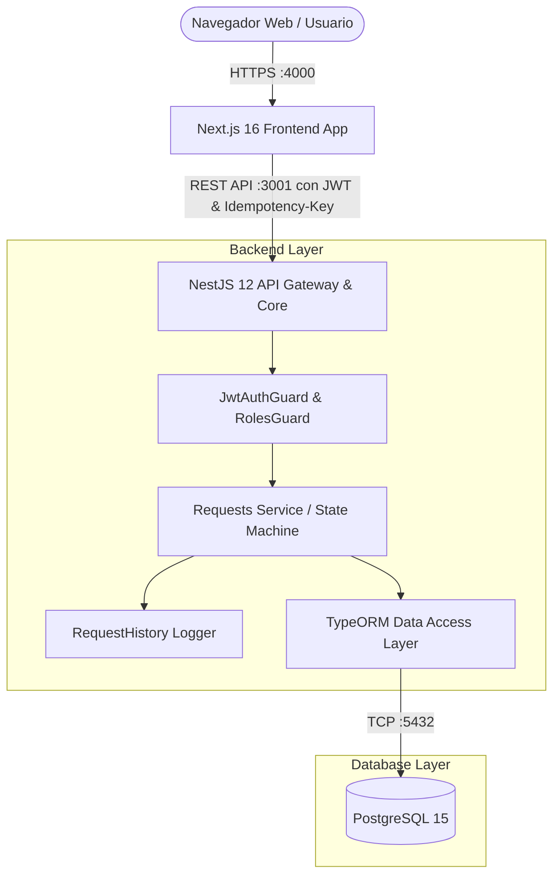
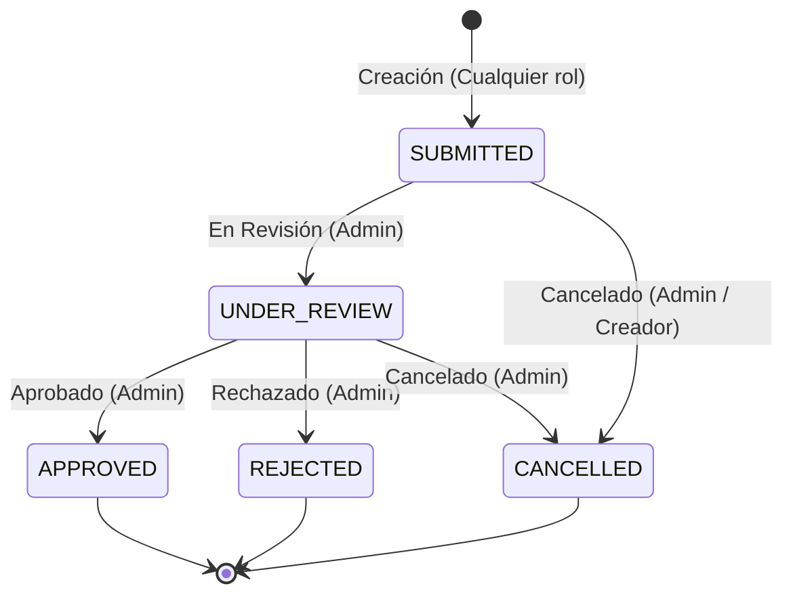
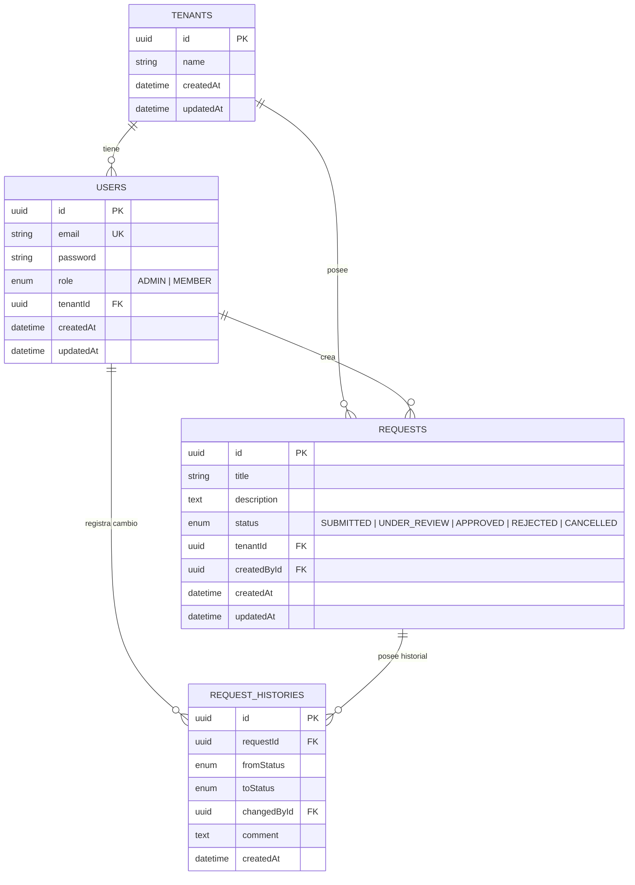

# 🏛️ Documento de Arquitectura de Software

Este documento detalla la arquitectura técnica, los patrones de diseño, las decisiones de infraestructura y el modelo de datos implementado en el sistema de gestión de solicitudes de **BluePixel**.

---

## 1. Visión General del Sistema

El sistema es una plataforma web **multi-tenant** diseñada para la recepción, revisión, aprobación y auditoría de solicitudes operativas. Su diseño prioriza la **seguridad**, la **consistencia de datos**, el **aislamiento organizacional** y una experiencia de usuario reactiva y fluida.



---

## 2. Componentes del Sistema

### 2.1. Frontend (`apps/frontend`)
- **Framework:** Next.js 16 con React 19 y App Router.
- **Manejo de Estado Asíncrono:** TanStack React Query v5 para cacheo inteligente, revalidaciones automáticas e invalidación de consultas tras mutaciones.
- **Capa de Comunicación:** Axios configurado con interceptores globales:
  - Inyección automática del token Bearer desde cookies seguras (`js-cookie`).
  - Inyección de cabecera `Idempotency-Key` (UUIDv4) en todas las operaciones mutables (`POST`, `PUT`, `PATCH`).
- **Diseño & UI:** Tailwind CSS v4 para una interfaz limpia, responsiva y con estados interactivos.
- **Rutas Principales:**
  - `/login`: Inicio de sesión y persistencia de sesión JWT.
  - `/dashboard`: Panel general con estadísticas acumuladas por estado y listado reactivo con filtros.
  - `/request/new`: Formulario protegido para la creación de solicitudes.
  - `/request/[id]`: Vista de detalle, flujo de transición de estados (para Administradores) y línea de tiempo histórica de auditoría.

### 2.2. Backend (`apps/backend`)
- **Framework:** NestJS 12 sobre Node.js 20, estructurado bajo arquitectura modular orientada a dominio.
- **Módulos Principales:**
  - `AuthModule`: Gestión de inicio de sesión, hashing de contraseñas con `bcrypt` y generación de tokens JWT.
  - `DatabaseModule`: Configuración de conexión TypeORM hacia PostgreSQL con soporte para auto-reconexión y sincronización de entidades.
  - `RequestsModule`: Lógica de negocio, control de estados, filtros por tenant y creación del historial de auditoría.
- **Seguridad & Guards:**
  - `JwtAuthGuard`: Valida la integridad y caducidad de los tokens en cada solicitud HTTP protegida.
  - `RolesGuard`: Aplica control de acceso basado en roles (`@Roles(Role.ADMIN)`) sobre rutas sensibles como la transición de estados.
  - `ValidationPipe`: Validación estricta de DTOs en tiempo de ejecución con `class-validator` y `class-transformer` (`whitelist: true`, `forbidNonWhitelisted: true`).

### 2.3. Base de Datos (`PostgreSQL 15`)
- Almacenamiento relacional normalizado con integridad referencial, índices sobre claves foráneas y cascada controlada.

---

## 3. Principios y Decisiones Arquitectónicas Clave

### 3.1. Aislamiento Multi-Tenant (Multi-Tenancy)
- **Estrategia:** Aislamiento lógico por discriminador de tenant (`tenantId`).
- **Implementación:**
  - Todas las entidades principales (`User`, `Request`) contienen una columna foránea obligatoria `tenantId`.
  - El `tenantId` del usuario autenticado se extrae de forma confiable directamente del payload de su JWT verificado, nunca de parámetros abiertos en el cliente o la URL.
  - Todas las consultas de lectura, escritura y conteo estadístico aplican automáticamente un filtro estricto por `tenantId`:
    ```typescript
    await this.requestRepo.find({
      where: { id, tenantId: user.tenantId },
      relations: ['createdBy', 'history', 'history.changedBy'],
    });
    ```
  - De este modo, usuarios de la *Empresa Alfa* no pueden leer ni modificar recursos pertenecientes a la *Empresa Beta*, garantizando estricta confidencialidad.

### 3.2. Máquina de Estados y Auditoría (State Machine & History)
Las solicitudes siguen un ciclo de vida formal y predecible:



- **Inmutabilidad del Historial:** Cada cambio de estado genera de forma transaccional una nueva fila en la tabla `request_histories` que registra:
  - Estado anterior (`fromStatus`) y nuevo estado (`toStatus`).
  - Usuario que realizó la acción (`changedById`).
  - Comentario o justificación operativa (`comment`).
  - Marca de tiempo (`createdAt`).

### 3.3. Idempotencia en Operaciones Mutables
- En operaciones de red donde el usuario o un reintento automático pueda duplicar peticiones (por ejemplo, doble clic en el botón de creación o desconexión transitoria), el cliente adjunta una cabecera única `Idempotency-Key` generada con UUIDv4.
- Esto permite al servidor o a proxies de borde identificar operaciones idénticas y prevenir duplicación de registros de negocio.

---

## 4. Modelo de Datos Relacional



---

## 5. Arquitectura de Despliegue y Contenedores

La solución utiliza Docker Compose con separación de etapas (*Multi-stage builds*) para garantizar imágenes ligeras, reproducibles y seguras:

1. **Etapa Builder:**
   - Instala dependencias completas de desarrollo.
   - Compila TypeScript a JavaScript optimizado (`nest build` / `next build`).
   - El frontend recibe la variable de entorno `NEXT_PUBLIC_API_URL` como argumento de compilación (`ARG`) para incrustarla en los bundles estáticos del navegador.

2. **Etapa Runner:**
   - Parte de una imagen limpia `node:20-alpine`.
   - Copia únicamente los artefactos compilados (`dist/` y `.next/`) y los paquetes necesarios.
   - Configura las variables de ejecución (`PORT`, `NODE_ENV=production`, `HOSTNAME=0.0.0.0`).

3. **Orquestación con Compose:**
   - **PostgreSQL:** Incluye `healthcheck` con `pg_isready` para verificar que la base de datos acepte conexiones antes de que el backend intente inicializarse.
   - **Backend:** Usa `depends_on: postgres: condition: service_healthy`, ejecutando primero `seed:prod` (que asegura la existencia de tablas y datos) e iniciando luego el servidor NestJS.
   - **Frontend:** Se inicia tras el backend y queda accesible en el puerto `4000`.
